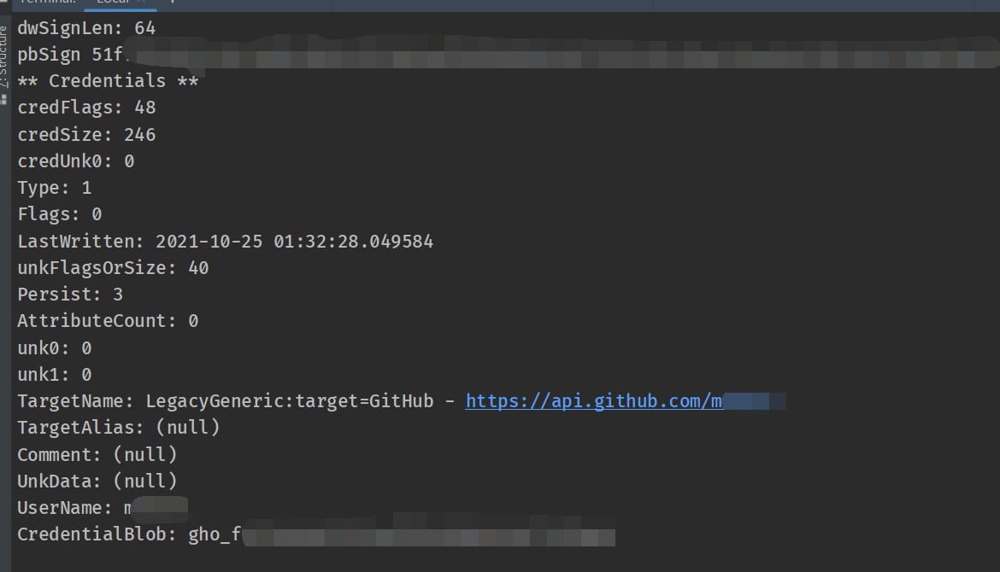

# CredentialsViewer


## Introduction

在`Windows pc`中，有许多重要的凭证文件，但这些文件都被加密了，有一些优秀的凭证解密器，如[`DataProtectionDecryptor`](https://www.nirsoft.net/utils/dpapi_data_decryptor.html)和[`CredentialsFileView`](https://www.nirsoft.net/utils/credentials_file_view.html)，用户只需输入登录的密钥，程序便能解密这些文件，进一步会暴露用户存储的其它密码信息。

上述两个软件没有开源源代码，本项目通过调试[`mimicatz`](https://github.com/gentilkiwi/mimikatz)源代码，用`python`复现了其中`diapi`模块的功能。

## Quick View

```python
python CredentialViewer.py
```

参数包括了`-p`，`-auto`，`-mk`，`-sid`，`-dc`等，含义如下：

```bash
-p user login password  # 用户登录密码,必填
-auto execute automatically # 自动搜索本机的相关文件,尝试解密凭证文件,可选
-mk master key filepath # 主密钥的文件路径,可选
-sid user sid # 用户对应的SID,可选
-dc credentials file path # 用户的凭证文件路径,可选
-skey # 搜索本机主密钥文件的路径
-scred # 搜索本机凭证文件所在路径
-show # 直接输出解析信息,可选
-save save_path #解密信息保存为csv文件,可选
```

可选的部分主要用于自动搜索文件失败，需要手动添加路径，或者离线解密其它计算机的文件的场景。例如解密其它主机的凭证文件，需要准备登录密码(`123456`)，主密钥和凭证文件(`demo1`文件夹中的部分)以及`sid`。

```python
python CredentialViewer.py -p 123456 -mk ./demo1/17b321e0-*-49bc-*-* -sid S-1-5-21-*-*-*-500 -dc ./demo1/9EB88D******CF09******D953******
```



## Environment

```bash
python 3.6 +
pycryptodomex ~= 3.15.0
```

测试环境在`windows 10/11`主机上，这里需要本地账户，而不是微软账户！

## pyinstaller

打包的时候可能会出现`Cryptodome`模块，需要把`hook-Cryptodome.py`文件放置在`Lib/site-packages/Pyinstaller`文件夹中。

在打包时，执行以下命令。

```bash
pyinstaller CredentialViewer.py -F -p venv/Lib/site-packages
```

## END

再次感谢`mimicatz`开源项目，`demo`文件因为相对隐私，所以没有给出，源代码仅供学习参考，请勿做其它非法等用途。详细过程[Also See](https://djh-sudo.github.io/Blog/#/windows/0708/README)

## To be soved

由于解密用到的填充算法和标准接口不一致，因此`pbkdf2`函数没有使用`python`封装好的接口，因此这个函数的性能很不好，导致整个解密过程很慢，使用`numba`似乎也无法加速。